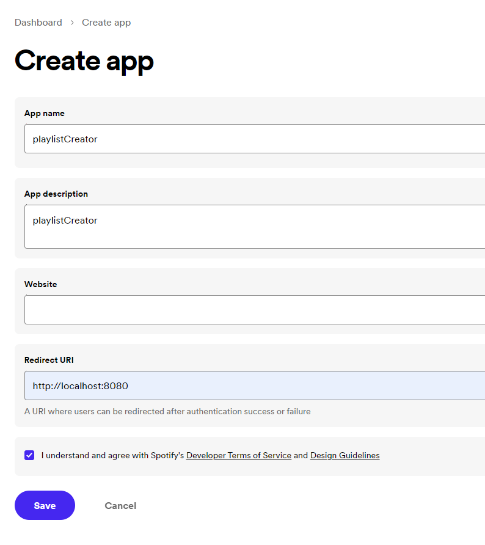

# createPlaylistSpotify

[](https://opensource.org/licenses/GPL-3.0)

Simple Python script for automated creation of playlists in Spotify from a list of tracks.

## Description

The `createPlaylistSpotify` script is designed to automate the process of creating playlists in Spotify. It reads a list of tracks from a file and uses the Spotify API to search for each track and add it to a playlist.

## Features

- Reads a list of tracks from a file in the format "artist - track name".
- Authenticates with the Spotify API using the `spotipy` library.
- Searches for each track using the Spotify API and adds it to a playlist.
- Easy-to-use and customizable.

## Requirements

- Python 3.x
- [spotipy](https://spotipy.readthedocs.io/) library (install using `pip install spotipy`)

## Usage

1. Clone this repository:

   ```bash
   git clone https://github.com/urgarth/createPlaylistSpotify.git
   cd createPlaylistSpotify
   ```
2. Create a file named track_list.txt in the same directory with your list of tracks in the format "artist - track name". Or you can change exist file.

3. Obtain your Spotify API credentials from the [Spotify Developer Dashboard](https://developer.spotify.com/dashboard/applications). Click "Create app" button, and fill the same:
   
   

5. Update the client_id, client_secret, and redirect_uri values in the script with your Spotify API credentials.

6. Run the script:

```bash
python create_playlist.py
```
Follow the prompts to authenticate with your Spotify account and create the playlist.
